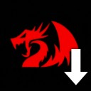
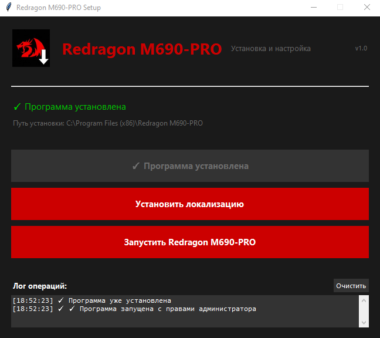

# 🖥️ Redragon M690-PRO Setup



> **Простой установщик софта Redragon M690-PRO с русским языком**

---

## 📋 Описание

Однофайловая программа для автоматической установки и настройки софта **Redragon M690-PRO**. 

### 🌍 Поддерживаемые языки

| # | Язык | Код |
|---|------|-----|
| 1 | Русский | ru |
| 2 | Українська | uk |
| 3 | Беларуская | be |
| 4 | Татарча | tt |
| 5 | Башҡортса | ba |
| 6 | Нохчийн | ce |
| 7 | Հայերեն | hy |
| 8 | English | en |
| 9 | 中文 | zh |

---

## ✨ Возможности

- 🚀 **Установка драйверов** (софта) Redragon M690-PRO в один клик
- 🌐 **Автоматическая локализация** интерфейса (9 языков)
- ⚙️ **Настройка конфигурации** без лишних действий
- 🖥️ **Интуитивный интерфейс** с логом операций
- 📦 **Один EXE-файл** - ничего устанавливать не нужно!

---

## 📥 Установка

### Системные требования

- **ОС:** Windows 7/8/10/11 (32/64-bit)
- **Права:** Администратор
- **Место:** ~50 МБ

### Установка (5 простых шагов)

1. **Скачайте** [`Redragon_Setup.exe`]()
2. **Запустите** от имени администратора
3. Нажмите **"Установить программу"**
4. Выполните установку программы выбрав все параметры как вам удобно и завершите установку
5. Нажмите **Установить локализацию**
Готово! Остаётся только открыть сам софт и выбрать нужный язык

---

## 🎯 Как пользоваться

### Главное окно



### Что делают кнопки

| Кнопка | Действие |
|--------|----------|
| **Установить программу** | Запускает установку драйверов |
| **Установить локализацию** | Применяет русский язык (и ещё 8 языков!) |
| **Запустить программу** | Открывает Redragon M690-PRO |

---

## 🐛 Устранение проблем

| Проблема | Решение |
|----------|---------|
| "Отказано в доступе" |	Запустите от имени администратора |
| Локализация не применяется |	Закройте Redragon M690-PRO и нажмите "Установить локализацию" |
| Установщик не работает | Используйте ручную установку |

---

## Ручная установка

1. Скачайте софт для M690-PRO [здесь](https://github.com/0ptim1st-DK/MouseSoft-Localization/blob/main/Files/download/Redragon_M690-PRO_Setup_v1.0%2020221125.exe) или с [официального сайта](https://redragonshop.com/blogs/product-download/mirage-m690-pro)
2. Выполните стандартную установку ПО
3. После успешной установки закройте программу а так же убедитесь что она не запущена в трее
4. Перейдите к расположению файлов софта (по умолчанию: "C:\Program Files (x86)\Redragon M690-PRO")
5. Замените папку ``` Text ``` и файл ``` Cfg.ini ``` на предоставленные в этом архиве  *[Тык]()*
6. После замены можно запускать программу и готово

## Redragon M690-PRO Setup v1.0 | Сделано для удобства пользователей!
